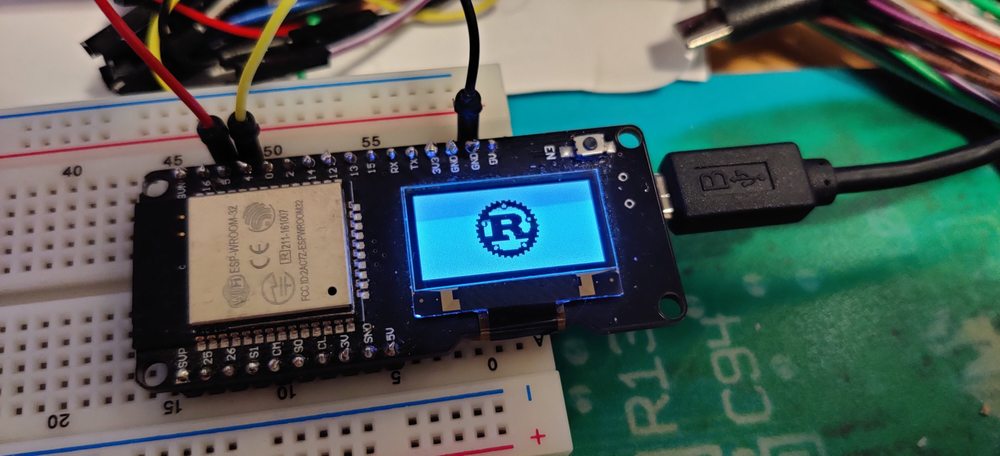

# Simple program to drive SSD1306 display on ESP32

# Prerequisites

* [ESPFlash](https://github.com/esp-rs/espflash)
* [rust-xtensa](https://github.com/MabezDev/rust-xtensa)
* [GCC toolchain for xtensa](https://dl.espressif.com/dl/xtensa-esp32-elf-gcc8_4_0-esp-2020r3-linux-amd64.tar.gz)
* SSD1306 connected via I2C

# Configuration

I2C pins are hard coded to GPIO4 (SCL) and GPIO5 (SDA) for now.
This matches the Wemos LOLIN32 board with OLED display.

Eg: https://www.aliexpress.com/item/33060366158.html

To change them, modify the setup_i2c() parameters.

# Build

```
. setenv
cargo espflash --release <serial port of ESP32>
```

# Result


